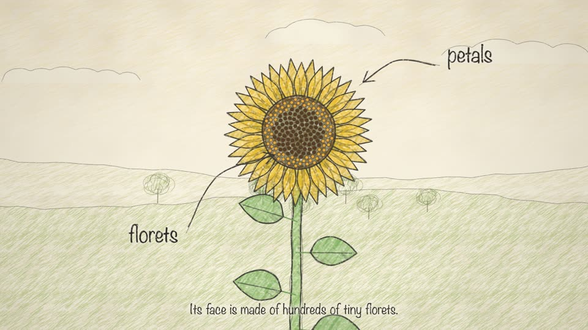

# The Life of a Sunflower (worked example, `pencil` look)



A 2-minute science explainer for children in the 2D pencil-sketch look: graphite outlines
and coloured-pencil hatching on drawing paper, a cut-away garden bed, handwritten captions
and a music-box score. There is **no voice-over**: every scene has a fixed `dur` and two or
three `captions`, and the action is timed in scene seconds.

Ten scenes: title · planting (a gardener digs, drops and waters the seed) · underground
(the seed wakes, splits, sends a root down and a shoot up, with a day counter) · seedling
(the hook breaks the soil, drops its seed coat, opens its seed leaves) · growing (rain, sun,
a 3 m ruler) · bud (follows the sun from east to west, turns back at night) · bloom (petals
unfurl, florets spiral in, labelled arrows) · bees (pollen carried between flowers) · seeds
(petals fall, the head bows, a finch pecks) · the life-cycle diagram, then an end page.

Build it in an empty folder:
```bash
KUANIMATION=/path/to/kuanimation        # the folder that holds SKILL.md
cp -R "$KUANIMATION"/assets/. .
cp -R "$KUANIMATION"/examples/sunflower/. .
npm i --no-audit --no-fund
node render.mjs film.html --grid 36 --width 960           # quick contact sheet
node mix.mjs film.html && node render.mjs film.html       # -> out/film-final.mp4
```
No API key and no Python are needed (`voice.js` is empty on purpose).

Things to study:
- `film.html`: `style: 'pencil'` and a custom end page (`end: END`).
- `scenes.js`: `dur` + `captions` for a voiceless film; camera moves that zoom into the soil
  (`sprout`), onto the flower (`bloom`) and back out (`seedling`); a sun on an arc
  that the bud tracks with `yaw` and `lean` (`bud`); keyframed flight paths with a
  dotted trail (`flight`, `trail` for the bees and the finch); the cycle diagram drawn on
  with `pathArrow` and `handText`.
- `flora.js`: a parametric plant, `plantT(c, x, groundY, {h, leaves, cot, head, bloom,
  yaw, droop, wilt, fallen, florets, seedy, age})`, that takes one sunflower from seed
  leaves to a seed head, and florets laid in the golden-angle spiral.
- `score.js`: one continuous chord progression across all scenes, with each scene setting
  how busy the tune is, plus effects (drips, pops, rain, a bee buzz, finch chirps).
